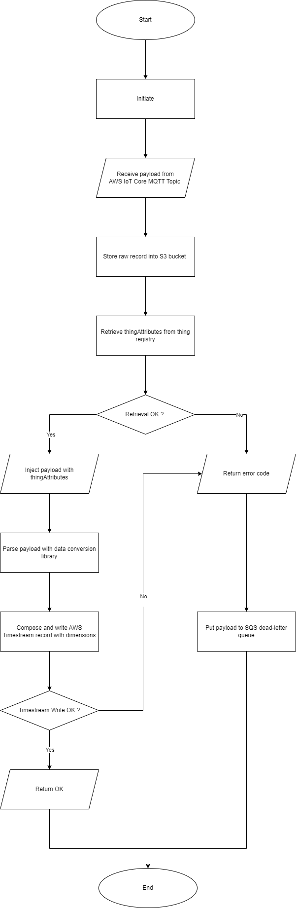

# Vehicle Data Ingestor AWS Lambda
This lambda function code is triggered by AWS IoT rule to parse MQTT message payload sent by vehicle OBD logger, and write to timestream. Please refer to [this](https://docs.aws.amazon.com/iot/latest/developerguide/iot-create-role.html) guide on how to grant required permission for AWS IoT rule and [this](https://docs.aws.amazon.com/lambda/latest/dg/lambda-permissions.html) guide for lambda function.

## MQTT Topic 
MQTT topic  for sending data is defined as follows:
`data/<device_model>/<organization>/<device_id>`

## Vehicle Data Identification
Vehicle logger management is done using AWS IoT Core Thing Registry.  

Each logger is organized into `vehicle_data_logger` thing type with the following searchable thing attributes:  
- `device_id` (IMEI number)
- `device_model` (manufacturer and device model)
- `organization` (Organizatoin name)
  
When deployed to a vehicle, each logger is assigned the following non-searchable attributes to denote details of the vehicle of which the logger is deployed.
- `power_source` (power source used by the propulsion system of the vehicle)
- `vehicle_id` (vehicle identification number)
- `licence_plate` (licence plate number)
- `vehicle_manufacturer` (manufacturer of the vehicle)
- `vehicle_model` (model of the vehicle)
- `vehicle_type` (vehicle type defined by local legislation body of which the vehicle is operating)
- `location` (location of which the vehicle is registered and operated)
  
These [ThingAttributes](https://docs.aws.amazon.com/iot/latest/apireference/API_ThingAttribute.html) are used as [Dimensions](https://docs.aws.amazon.com/timestream/latest/developerguide/API_Dimension.html) of the data points generated by the logger when writing to AWS Timestream database.

## Logic Flow

